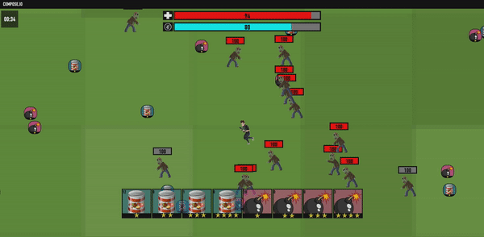

**compose.io** is an online browser game for studying how humans acquire rule concepts and generalize to other rulesets. The game has a customizable crafting system that allows you to implement arbitrary rulesets. 

Uses React for frontend and Airtable/Rest to record behavioral data. 

The application is live at: https://romantic-sinoussi-657706.netlify.app/

  

### `npm start`

Runs the app in the development mode.\
Open [http://localhost:3000](http://localhost:3000) to view it in the browser.