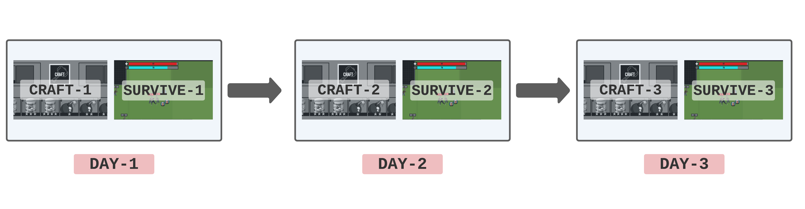

## Titles
1. Studying Human Rule Learning in Virtual Environments. 
2. Online Crafting Games for Studying Human Rule Learning.
3. Customizable Crafting Games are Rule Learning Experiments. 

## Abstract

[Compose.io](https://compose-io.netlify.app/) is a customizable browser game designed for large-scale behavioral data collection for symbolic rule learning and generalization experiments. Each level in the game consists of a survival phase where the player has to gather and use items to stay alive, and a crafting phase where items can be combined together to yield other items. Researchers can set their own custom crafting rules to study how humans learn the underlying rule system through trial and error. By chaining multiple levels with different rulesets one after another, researchers can also study how humans generalize from one rule system to another. We also use the framework to conduct an example experiment, arguing that exposure to a strict rule system prior to a more permissible system results in less exploration during crafting.

---

## 1. Introduction

1. Overview: Rule learning and generalization experiments. (similar to [dissertation](https://egeersu.github.io/papers/dissertation.pdf))
2. Our framework studies rule learning as trial & error over time, as opposed to symbolic translation on a fixed training/test dataset. Therefore our data shows attempts over time. 
3. Games are good.
    - Infants learn by interacting & playing with a complex environment. With games, we can study how the participant’s gameplay decisions evolve over time conditioned on the feedback they receive from an environment. 
    - Entertainment is a natural incentive, we can collect data without paying. (Compare prolific vs convenience sample in analysis)

---
## 2. Game Design 

1. **Crafting is Symbolic Translation**
   * Any rule can be implemented as a crafting rule, as long as it specifies an output for each possible input. 

3. **Survival Games**
   * Successful crafters have a higher chance of survival. 
   * Items make the player stronger and destroy enemies. They are not purely symbolic entities like in most experiments. 

4. **Scarcity** 
   * Resources are limited, so attempts have to be earned through gathering.
   * This limits the number of attempts, improving data quality. 

5. **Levels are Trials** 

---
## 3. Experiments

### Groups

| Group   |      Training      |  Testing |
|----------|:-------------:|------:|
| 1 |  Permissible | Permissible |
| 2 |    Strict   |   Strict |
| 3 | Permissible |    Strict |
| 4 |  Strict | Permissible |

### Experiment 1: 

> Exposure to a strict system prior to a flexible system causes participants to be more conservative when learning the new system. 

### Experiment 2: 
> Exposure to a flexible system prior to a strict system should cause a low-accuracy _adaptation period_ at the start of the testing phase. 

---

## Discussion 
The framework would also be useful for researchers studying how humans learn to apply rules \& functions, generalize to novel inputs and even compose multiple learned functions together. By treating symbolic rule learning as a trial-and-error learning task, we are able to collect a dataset of learning attempts over time. 

For example the acquisition of the _fep_ function from [Lake et al.](https://arxiv.org/pdf/1901.04587.pdf) can be studied by (1) adding the function to the configuration file as a collectable item and (2) adding the corresponding rules into the ruleset. Similarly collecting data for the acquisition of _copy_ and _blicket_ functions from [Hupkes et al.](https://arxiv.org/abs/1908.08351) would benefit researchers aiming to compare humans learning with neural models.

