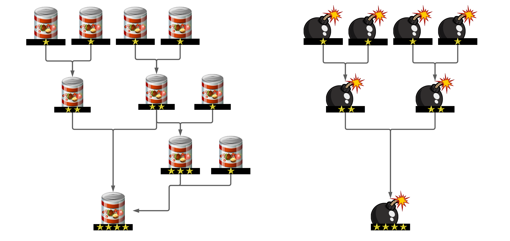
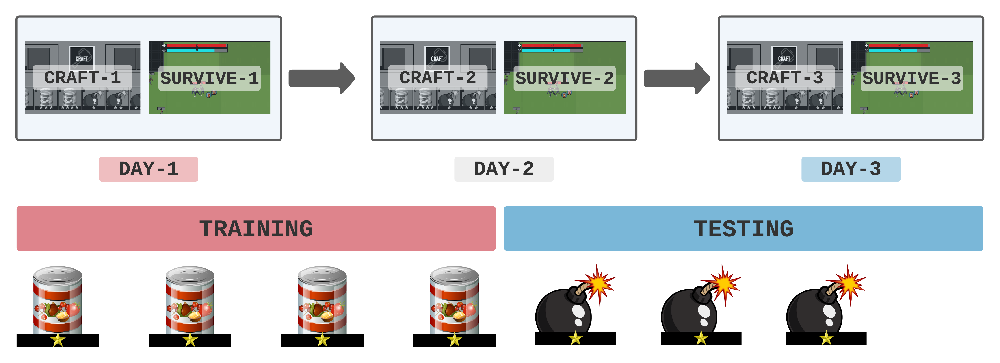
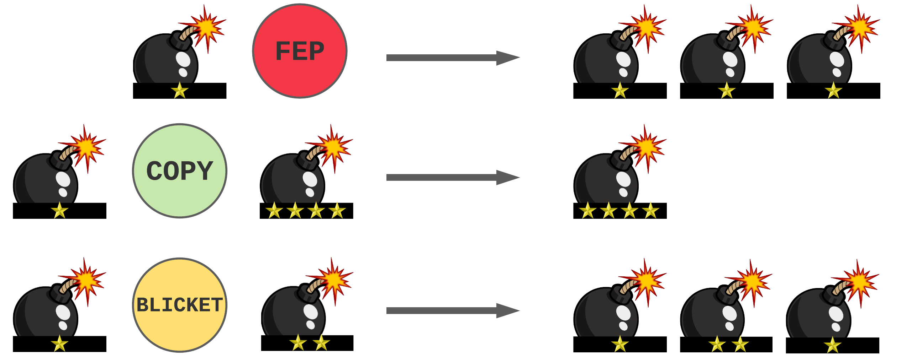

## Titles
1. Studying Human Rule Learning in Virtual Environments. 
2. Online Crafting Games for Studying Human Rule Learning.
3. Customizable Crafting Games are Rule Learning Experiments. 

## Abstract

[Compose.io](https://compose-io.netlify.app/) is a customizable browser game designed for large-scale behavioral data collection for symbolic rule learning and generalization experiments. Each level in the game consists of a survival phase where the player has to gather and use items to stay alive, and a crafting phase where items can be combined together to yield other items. Researchers can set their own custom crafting rules to study how humans learn the underlying rule system through trial and error. By chaining multiple levels with different rulesets one after another, researchers can also study how humans generalize from one rule system to another. We also use the framework to conduct an example experiment, arguing that exposure to a strict rule system prior to a more permissible system results in less exploration during crafting.

---

## 1. Introduction

1. Overview: Rule learning and generalization experiments. (Concise version of the [Dissertation](https://egeersu.github.io/papers/dissertation.pdf))
2. Our framework studies rule learning as discovery (trial & error over time), as opposed to symbolic translation on a fixed training/test dataset. Our data is learning attempts over time as the participant discovers the underlying ruleset. 
3. Hype up [Games to Understand Intelligence](https://cognitivesciencesociety.org/wp-content/uploads/2021/05/WS2.pdf) 
    - Infants learn by interacting & playing with a complex environment. With games, we can study how the participant’s gameplay decisions evolve over time conditioned on the feedback they receive from an environment. 
    - Entertainment is a natural incentive, we can collect data without paying. (Compare prolific vs convenience sample in analysis)

---
## 2. Game Design 

1. **Crafting is Symbolic Translation**
   * A popular game mechanism with rules and compositionality built into it. 
   * Any symbolic rule can be implemented as a crafting rule, as long as it specifies an output for each possible input. 
   

2. **Survival Games**
   * Rule learning is no longer an end in itself, it is a mean to survive and win a game.
   * Items are no longer purely symbolic entities like in most experiments. They impact the environment and make the player stronger. 
   * Higher level items get exponentially stronger, which incentivizes players to craft rather than hold low-level items. (Correlation between number of Level 4 items crafted and winning the game)

3. **Scarcity for Improving Data Quality** 
   * Resources are limited, so attempts have to be earned via gathering.
   * This limits the number of attempts, raising the stakes for each attempt. 

4. **Levels are Trials** 
   * Each Level consists of two customizable phases: Crafting and Survival. 
   * Each Crafting phase can be assigned its own custom ruleset.
   * Each Survival phase can be assigned its own item distribution to control which items spawn for gathering. This is used to control the items that will be used in the next crafting phase. 
   * Levels can be chained one after another.
    

---
## 3. Experiments

### Groups

| Group   |      Training      |  Testing |
|----------|:-------------:|------:|
| 1 |  Permissible | Permissible |
| 2 |    Strict   |   Strict |
| 3 | Permissible |    Strict |
| 4 |  Strict | Permissible |

### Experiment 1: 

> Exposure to a strict system prior to a permissible system causes participants to be more conservative (less exploration?) when learning the new system. 

* For each participant compute a conservativeness score (permissible / total attempts) for the testing phase. 
* Compare Group 1 with Group 4 with p-value.
* Follow [Simon's APA guidelines](https://www.scribbr.com/apa-style/results-section/)

### Experiment 2: 
> Exposure to a flexible system prior to a strict system should cause a low-accuracy _adaptation period_ at the start of the testing phase. 

* For each participant compute testing accuracy for the first $k$ attempts.
* Compare Group 2 and Group 3 with p-value. 
---

## 4. Discussion 
1. Hypothesis 1
2. Hypothesis 2
3. Compare Convenience Sample to Prolific

### Future Work

The framework would also be useful for researchers studying how humans learn to apply rules \& functions, generalize to novel inputs and even compose multiple learned functions together. By treating symbolic rule learning as a trial-and-error learning task, we are able to collect a dataset of learning attempts over time. 

For example the acquisition of the _fep_ function from [Lake et al.](https://arxiv.org/pdf/1901.04587.pdf) can be studied by (1) adding the function to the configuration file as a collectable item and (2) adding the corresponding rules into the ruleset. Similarly collecting data for the acquisition of _copy_ and _blicket_ functions from [Hupkes et al.](https://arxiv.org/abs/1908.08351) would benefit researchers aiming to compare humans learning with neural models.

> TODO: Prepare config files for replicating actual experiments from the literature. 

